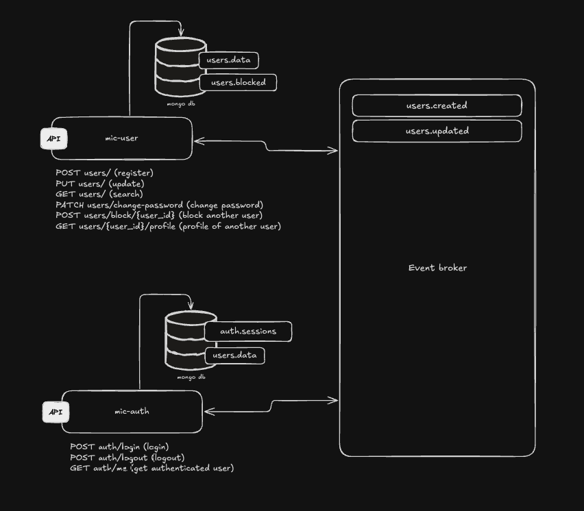

### * This project is constantly evolving and takes an incremental approach to improvements. *

## Project setup

```bash
$ yarn install
```

## Compile and run the project

```bash
$ yarn start:dev
```

## Base architecture proposal
